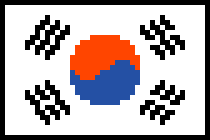

# r/korea_place

## 현재 도안 (Current Design)

좌상단 꼭지점: 458, 650

## 외교 (Diplomacy)

### 동맹 (Allied)

공격받을 때 서로를 도와줍니다. 
We help each other in case one is under attack.

- American Flag in Place (https://discord.gg/afip)
- Taiwan r/placeTW & r/taiwanica server (https://discord.gg/8xSQKCHSnT)
- TQQ Pixel Wars (https://discord.gg/E5XcGVSt)
- r/IndiaPlace (https://discord.gg/APEs3vJH)
- r/Bangladesh (https://discord.gg/bangladesh)
- r/PlaceSG (https://discord.gg/MY2bMNdApa)

### 우호 (Friendly)

서로 공격하지 않습니다. 
We do not attack each other.

- PlaceFR (https://discord.gg/placefr-959455317886902302)

## 오버레이 스크립트 사용법

1. **Violentmoneky**라는 브라우저 확장 프로그램을 [내려받습니다](https://violentmonkey.github.io/get-it/).
2. **Template Manager**라는 위 확장 프로그램으로 사용할 스크립트를 [설치합니다](https://github.com/osuplace/templateManager/raw/main/dist/templateManager.user.js).
3. [이 링크](https://new.reddit.com/r/place?jsontemplate=https://github.com/HaneulCheong/r-korea-place/blob/main/templates/flag/endu_template.json)로 **r/place**에 접속합니다.
4. 전투 준비 완료!

## 중요 링크 (Important Links)

- https://charity.pxls.space/
- https://charity.pxls.space/tutorial
- https://colorswall.com/palette/188214
